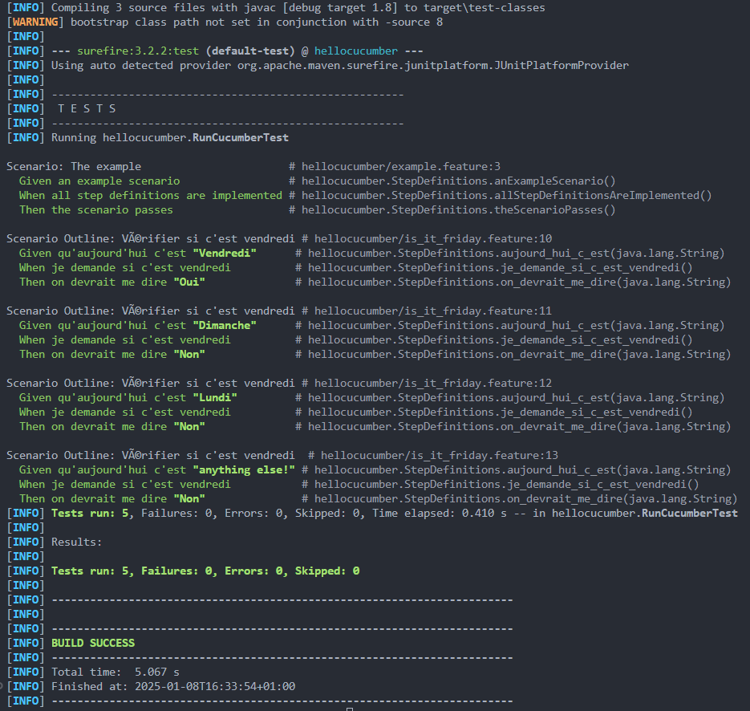

= R5.A.08 -- Dépôt pour les TPs
:icons: font
:MoSCoW: https://fr.wikipedia.org/wiki/M%C3%A9thode_MoSCoW[MoSCoW]

Ce dépôt concerne les rendus de mailto:tanguy.picuira@etu.univ-tlse2.fr[Tanguy Picuira].

== TP1

.Contenu du fichier is_it_friday.feature
[source,java]
----
Feature: Est-ce vendredi ?

    Scenario Outline: Vérifier si c'est vendredi
        Given qu'aujourd'hui c'est "<day>"
        When je demande si c'est vendredi
        Then on devrait me dire "<answer>"

    Examples:
        | day            | answer |
        | Vendredi       | Oui    |
        | Dimanche       | Non    |
        | Lundi          | Non    |
        | anything else! | Non    |
----

Exécution de la commande suivante:
[source,java]
mvn test

Résultat:

.Capture d’écran de l’exécution avec succès des tests

== TP2

.Contenu du fichier Order.java
[source,java]
----
package dojo;

import java.util.ArrayList;
import java.util.List;

public class Order {
    private String owner;
    private String target;
    private List<String> cocktails = new ArrayList<>();
    private String message;

    public void declareOwner(String owner) {
        this.owner = owner;
    }

    public void declareTarget(String target) {
        this.target = target;
    }

    public void addCocktail(String cocktail) {
        cocktails.add(cocktail);
    }

    public List<String> getCocktails() {
        return cocktails;
    }

    public void addMessage(String message) {
        this.message = message;
    }

    public String getTicket() {
        return "From " + owner + " to " + target + ": " + message;
    }
}
----

Résultat:

.Capture d’écran de l’exécution avec succès des tests
image::SuccessTestsTP2QualDev.png[width=80%]
